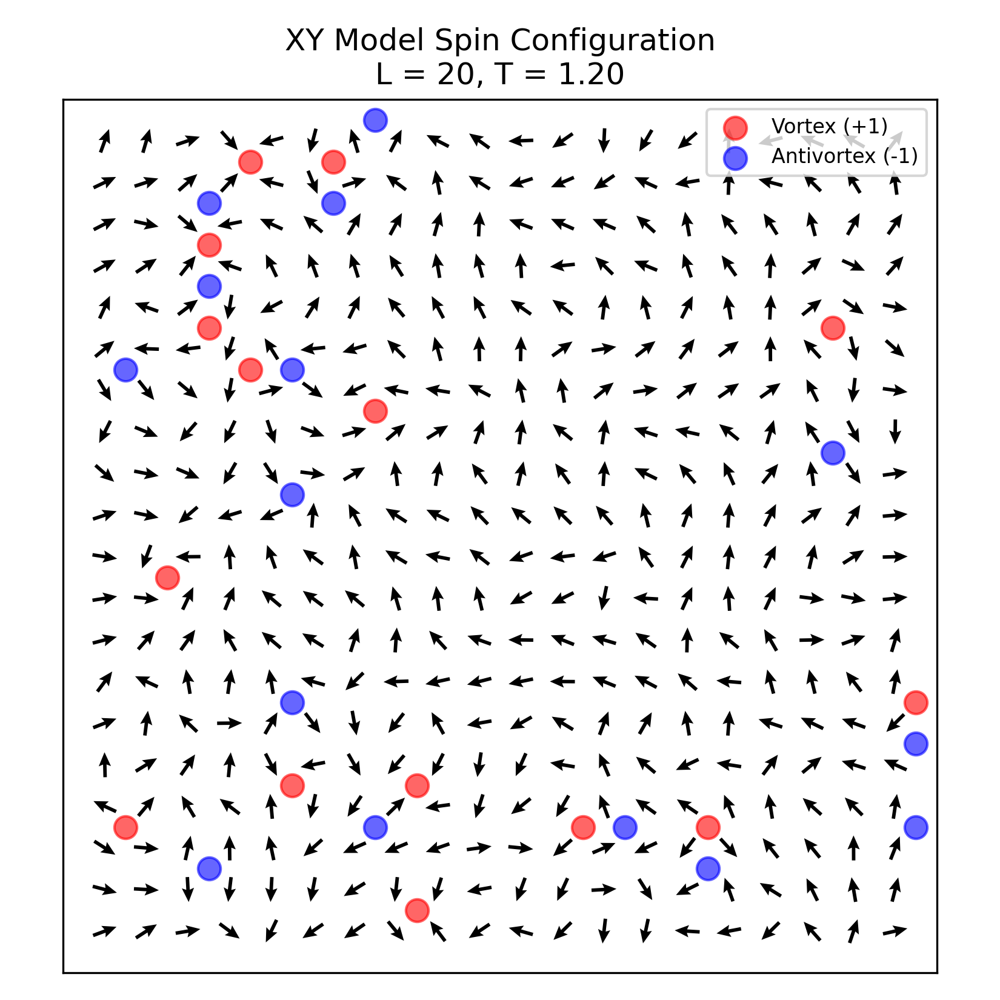
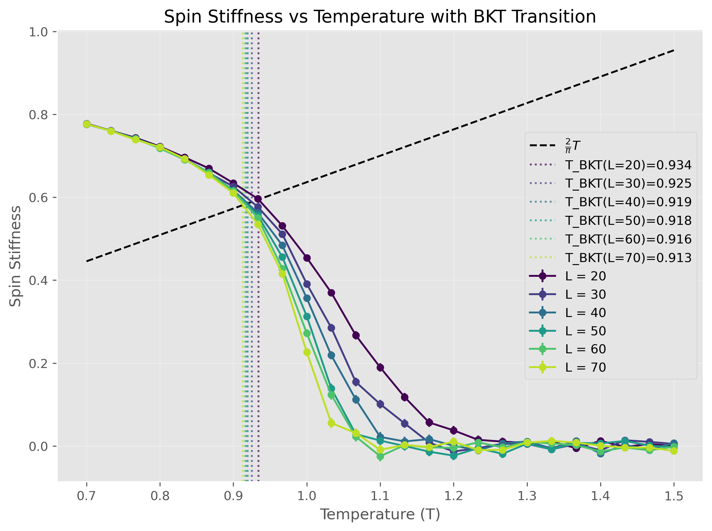
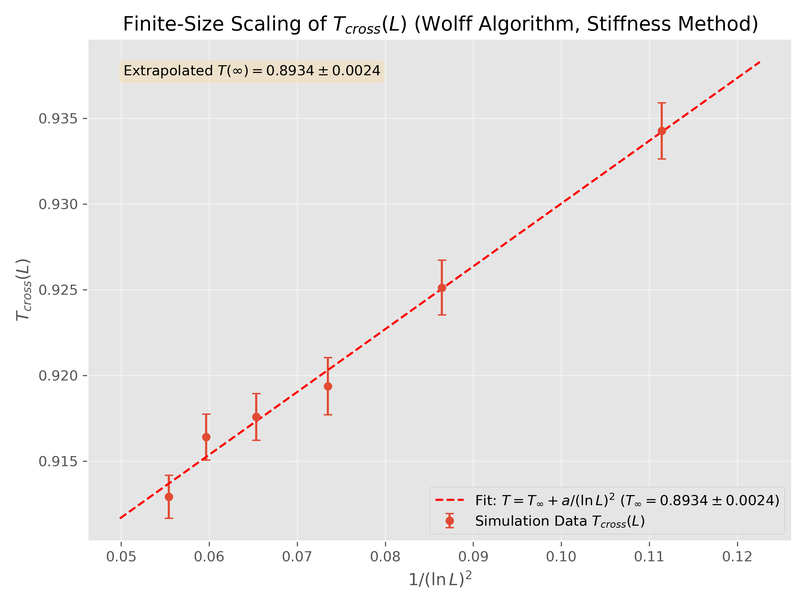

# Fast Implementation of 2D XY Model Simulations

This directory contains Python scripts for simulating the 2D XY model on a square lattice, optimized for performance using Numba and the Wolff cluster algorithm. The primary goal is to study the Berezinskii–Kosterlitz–Thouless (BKT) transition.

## Overview

The code implements Monte Carlo simulations of the classical XY model with Hamiltonian:
```math
H = -J \sum_{\langle i,j \rangle} \cos(\theta_i - \theta_j)
```
It utilizes the efficient Wolff cluster update algorithm, which significantly reduces critical slowing down near the BKT transition temperature compared to local update methods like Metropolis. Numba `@njit` decorators are used to accelerate computationally intensive parts of the simulation and analysis.

## Contents

*   **`simulate.py`**: The main script for running large-scale simulations.
    *   Performs Wolff algorithm sweeps for various system sizes (`L`) and temperatures (`T`).
    *   Calculates key physical observables:
        *   Energy
        *   Specific heat
        *   Magnetization
        *   Susceptibility
        *   Spin stiffness (helicity modulus)
        *   Vortex density
    *   Performs finite-size scaling (FSS) analysis, particularly focusing on the helicity modulus jump and susceptibility divergence to estimate the BKT transition temperature ($$T_{\text{BKT}}$$).
    *   Saves raw simulation data and generates plots of the observables and FSS analysis.

*   **`visualize.py`**: A script to generate visualizations of typical spin configurations and vortex-antivortex pairs at specific temperatures for a fixed system size (e.g., L=16).
    *   Runs short simulations to obtain equilibrated configurations.
    *   Plots the spin orientations as vectors on the lattice.
    *   Identifies and plots vortices (+1 winding) and antivortices (-1 winding) based on plaquette angle differences.

## Key Visualizations

1.  **Spin Configurations and Vortices**: Shows the microscopic state of the system at different temperatures, highlighting the proliferation of unbound vortex-antivortex pairs above $$T_{\text{BKT}}$$. Generated by `visualize.py`.
    

2.  **Observable Comparisons**: Plots quantities like helicity modulus, susceptibility, and specific heat against temperature for different system sizes. This illustrates the characteristic properties of the BKT transition. Generated by `simulate.py`.
    

3.  **Finite-Size Scaling**: Demonstrates the scaling of the crossing temperature $$T_{\text{BKT}}(L)$$ derived from the helicity modulus, confirming BKT scaling theory and allowing for precise estimation of $$T_{\text{BKT}}(\infty)$$. Generated by `simulate.py`.
    

## Usage

### Running Simulations

Modify parameters (L, temperatures, sweeps, J, etc.) within `simulate.py` as needed.

```bash
python simulate.py
```
Results and plots will be saved in `xy_model_results/`.

### Generating Visualizations

Modify parameters (L_VIS, TEMPERATURES_VIS, etc.) within `visualize.py`.

```bash
python visualize.py
```
The visualization plot will be saved in `visualization_results/`.